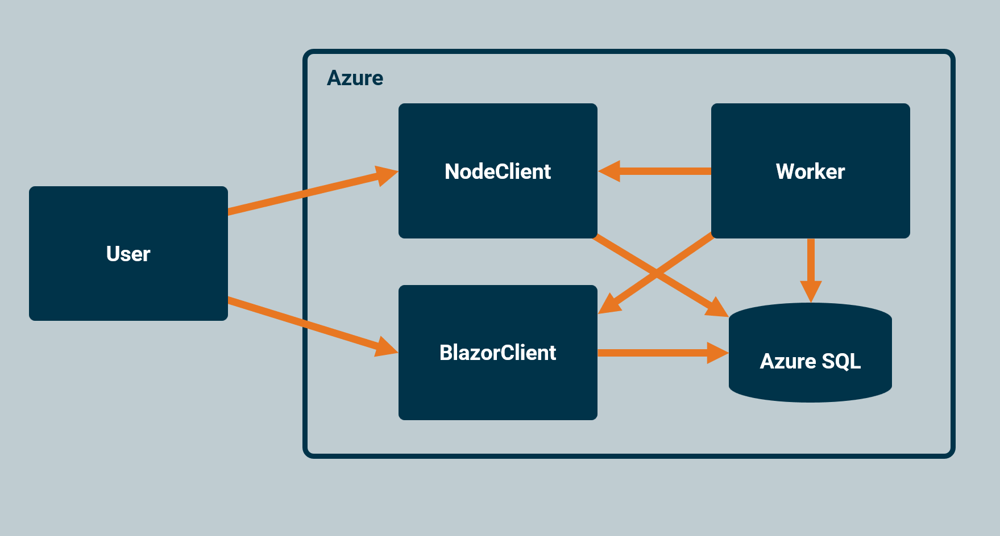

# Rapid Threat Modeling Workshop

This repository contains materials for the Rapid Threat Modeling workshop.
In this workshop you will analyse the provided system architecture to identify
potential security vulnerabilities using rapid threat modeling.

The focus is on understanding how data flows to identifying weak points,
and then look for vulnerabilities the codebase, using this information.

## Architecture

This example system includes three application servers and one Azure SQL
database. All servers read from the database, but only the Worker (.NET)
accesses sensitive data in the database. The Worker then distributes this
confidential data to two public servers: an ASP.NET web server and Node.js
web server.

- The **.NET Public Server** hosts both an API and a Blazor Server frontend,
  the latter of which is accessible only to users authenticated via Entra ID.
- The **Node.js Public Server** serves an API that provides both database data and
  data received from the Worker.
- The **.NET Worker Server** loads sensitive data from the database and pushes
  this data periodically to the two public servers through HTTP POST requests.

Clients (both browsers and servers) consume the public APIs and the Blazor
frontend.

